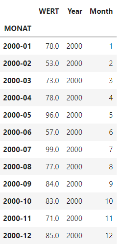
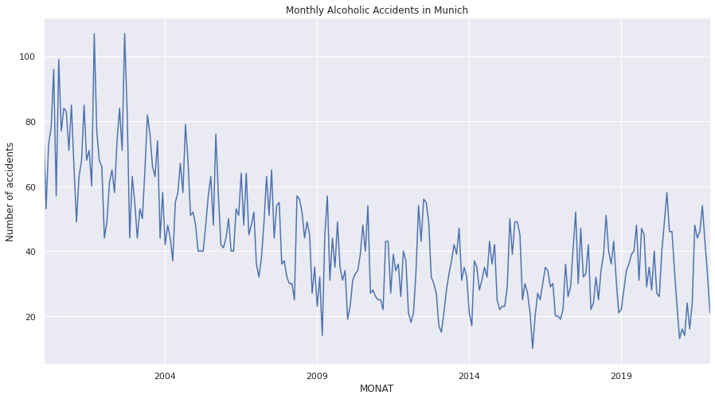
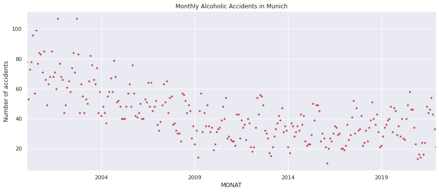
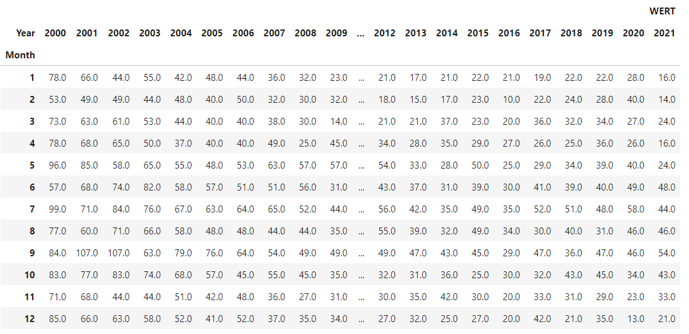
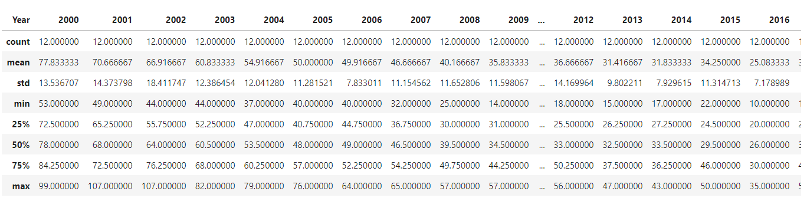
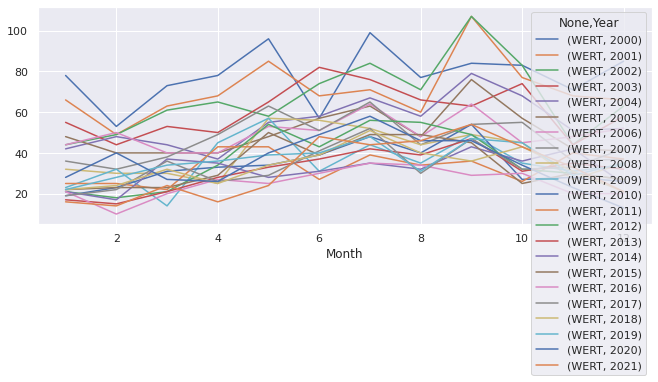
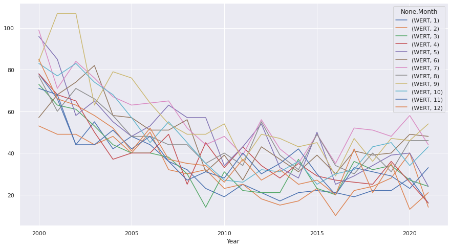
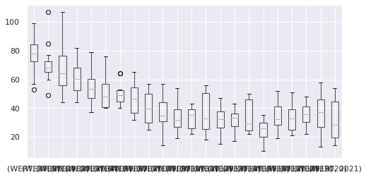
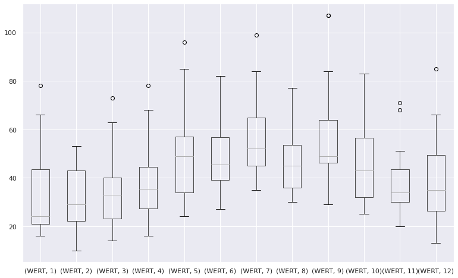
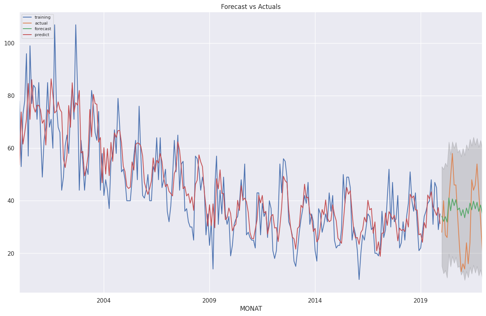

# DPS AI CHALLENGE

## Description

The dataset is “Monatszahlen Verkehrsunfälle” Dataset from the [München Open Data Portal](https://www.opengov-muenchen.de/dataset/monatszahlen-verkehrsunfaelle/resource/40094bd6-f82d-4979-949b-26c8dc00b9a7).

This dataset contains 2086 rows, where each corresponds to the number of accidents for specific categories per month. Important are the first 5 columns:

- `'MONATSZAHL'` contains *the category of the accident* e.g. "Alkoholunfälle" which are alcohol accidents or "Verkehrsunfälle" which correspond to traffic accidents.

- `'AUSPRAEGUNG'` which stands for *Accident-type* for example "insgesamt" provides the overall subcategories and "Verletzte und Getötete" provides injured and killed

- `'JAHR'` stands for *the year*;

- `'MONAT'` represents *the month* of the corresponding year; and,

- `'WERT'` is an integer number which represents *the value* of accidents.

## Mission 1

The first goal is to visualise historically the number of accidents per category (`'Alkoholunfälle`'). The dataset currently contains values until the end of 2021. Create an application that forecasts the values for:

- **Category**: 'Alkoholunfälle'
- **Type**: 'insgesamt
- **Year**: '2022'
- **Month**: '01'

### Visualisations

The step by step procedure to the solution can be found in <a href="https://github.com/mahmoudfazeli/Munich-Monthly-Alcoholic-Accidents/blob/main/munich-monthly-alcoholic-accidents.ipynb"><b>this notebook</b></a>. Here are some important visualisations:













## Mission 2
The flask app of the AI model is deployed on heroku, which can be found at:
https://mahmoud-fazeli-dps.herokuapp.com and the API endpoint is:
https://mahmoud-fazeli-dps.herokuapp.com/api/predict.
The endpoint accepts a POST request with a JSON body like this:
```
{
"year" : 2020,
"month" : 10
}
```
It return prediction in the following format:
```
{
"prediction" : value
}
```

## Packages
The required packages are:

- numpy
- pandas
- statsmodels
- sklearn
- Flask
- gunicorn
